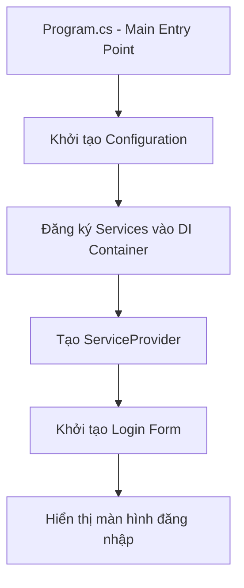
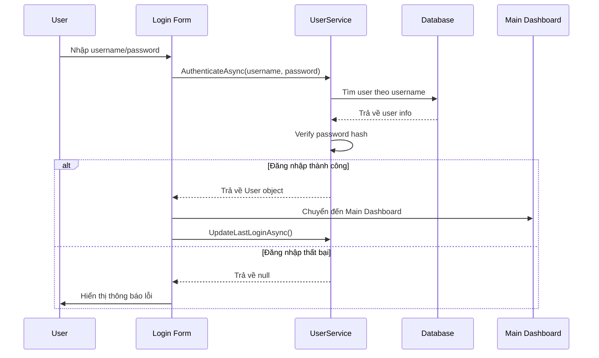
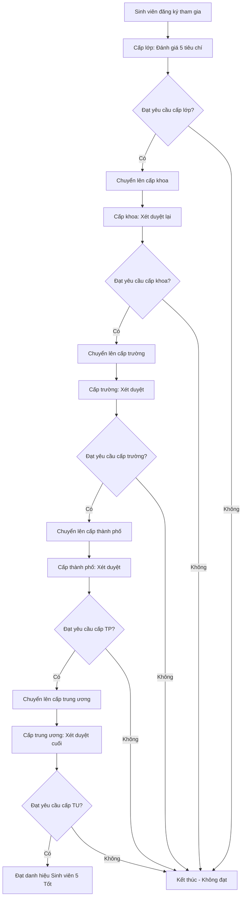
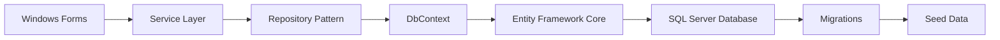

# 🎓 Hệ thống Quản lý Sinh viên 5 Tốt

[](https://dotnet.microsoft.com/download/dotnet/8.0)
[](https://docs.microsoft.com/en-us/dotnet/desktop/winforms/)
[](https://docs.microsoft.com/en-us/ef/core/)
[](https://www.microsoft.com/en-us/sql-server/)

## 📋 Mô tả dự án

Hệ thống phần mềm **Quản lý Sinh viên 5 Tốt** được xây dựng nhằm hỗ trợ công tác quản lý, đánh giá và xét duyệt danh hiệu **"Sinh viên 5 tốt"** qua nhiều cấp từ lớp đến trung ương. 

### 🎯 Mục tiêu chính
- Quản lý cơ cấu tổ chức (khoa, lớp)
- Quản lý thông tin sinh viên
- Quản lý tiêu chí đánh giá và cấp xét duyệt
- Đánh giá sinh viên theo 5 tiêu chí chính
- Quản lý minh chứng và theo dõi kết quả đạt danh hiệu
- Hỗ trợ quy trình xét duyệt từ cấp lớp lên trung ương

## 🏛️ Cấu trúc hệ thống "5 Tốt"

### 📊 5 Tiêu chí đánh giá
1. **🎭 Đạo đức tốt** - Có lối sống, đạo đức tốt
2. **📚 Học tập tốt** - Kết quả học tập xuất sắc  
3. **💪 Thể lực tốt** - Tích cực tham gia thể thao
4. **🤝 Tình nguyện tốt** - Tích cực tham gia hoạt động tình nguyện
5. **🌍 Hội nhập tốt** - Tích cực tham gia các hoạt động xã hội

### 🏢 5 Cấp xét duyệt
1. **🏫 Cấp lớp** - Xét duyệt ban đầu
2. **🏛️ Cấp khoa** - Xét duyệt cấp khoa
3. **🏗️ Cấp trường** - Xét duyệt cấp trường
4. **🌆 Cấp thành phố** - Xét duyệt cấp địa phương
5. **🏛️ Cấp trung ương** - Xét duyệt cao nhất

## 👥 Hệ thống Phân quyền & Vai trò

Hệ thống được thiết kế với cấu trúc phân quyền 3 nhóm chính, đảm bảo quy trình xét duyệt chặt chẽ và hiệu quả:

### 1. Nhóm Xét duyệt & Quản lý Nghiệp vụ ⚙️
Nhóm người dùng cốt lõi, thực hiện các công việc chính của quy trình xét duyệt. Quyền hạn được phân cấp từ thấp đến cao:

#### 🎓 Cố vấn Học tập (CVHT)
- **Nhiệm vụ chính**: 
  - Duyệt minh chứng đầu tiên ở cấp Lớp
  - Gửi phản hồi, yêu cầu bổ sung cho sinh viên
  - Import danh sách sinh viên cho lớp mình phụ trách
- **Phạm vi quyền hạn**: Chỉ xem và duyệt minh chứng của sinh viên trong lớp mình

#### 🏛️ Ban Chấp hành Đoàn Khoa (BCH Đoàn Khoa)
- **Nhiệm vụ chính**:
  - Duyệt hồ sơ đã được CVHT thông qua
  - Công nhận danh hiệu cấp Khoa
  - Xem thống kê của toàn Khoa
  - Tạo và quản lý tài khoản CVHT
- **Phạm vi quyền hạn**: Toàn bộ sinh viên và CVHT trong Khoa

#### 🏗️ Ban Chấp hành Đoàn Trường (BCH Đoàn Trường)
- **Nhiệm vụ chính**:
  - Duyệt hồ sơ từ cấp Khoa gửi lên
  - Công nhận danh hiệu cấp Trường
  - Xem báo cáo, thống kê toàn Trường
  - Tạo và quản lý tài khoản Đoàn Khoa
- **Phạm vi quyền hạn**: Toàn bộ các Khoa trong Trường

#### 🌆 BCH Đoàn Thành phố
- **Nhiệm vụ chính**:
  - Xem báo cáo tổng hợp, thống kê dữ liệu
  - Đưa ra quyết định cấp Thành phố
  - Tạo và quản lý tài khoản Đoàn Trường
- **Phạm vi quyền hạn**: Toàn bộ các đơn vị trực thuộc Thành phố

#### 🏛️ BCH Đoàn Trung ương
- **Nhiệm vụ chính**:
  - Xem báo cáo tổng hợp cấp cao nhất
  - Đưa ra quyết định chiến lược
  - Tạo và quản lý tài khoản Đoàn Thành phố
- **Phạm vi quyền hạn**: Toàn bộ hệ thống cấp quốc gia

### 2. Nhóm Người tham gia 👥

#### 🎓 Sinh viên
- **Nhiệm vụ chính**:
  - Nộp, chỉnh sửa, xóa minh chứng cá nhân
  - Theo dõi trạng thái (chờ duyệt, đã duyệt, bị từ chối)
  - Xem phản hồi từ người duyệt
- **Phạm vi quyền hạn**: Chỉ xem và thao tác trên dữ liệu của chính mình

### 3. Nhóm Quản trị Hệ thống 👑

#### 📚 Giáo vụ (Admin cấp Trường)
- **Nhiệm vụ chính**:
  - Đảm bảo tính toàn vẹn dữ liệu sinh viên
  - Import danh sách sinh viên hàng loạt từ file chính thức
  - Quản lý thông tin sinh viên toàn Trường
- **Phạm vi quyền hạn**: Quản lý thông tin và tài khoản toàn bộ sinh viên

#### 👑 Quản trị viên Tối cao (Super Admin)
- **Nhiệm vụ chính**:
  - Quản lý toàn bộ hệ thống
  - Cấu hình Năm học, Tiêu chí, Yêu cầu xét duyệt
  - Quản lý tất cả tài khoản
  - Can thiệp khi cần thiết
- **Phạm vi quyền hạn**: Toàn bộ hệ thống, không giới hạn

### 🔐 Ma trận Phân quyền

| Vai trò | Dashboard | Xét duyệt | Quản lý User | Báo cáo | Cấu hình |
|---------|-----------|-----------|--------------|---------|----------|
| **Super Admin** | ✅ | ✅ | ✅ | ✅ | ✅ |
| **Giáo vụ** | ✅ | ✅ | ✅ (Sinh viên) | ✅ | ❌ |
| **BCH Đoàn Trường** | ✅ | ✅ (Cấp Trường) | ✅ (Đoàn Khoa) | ✅ | ❌ |
| **BCH Đoàn Khoa** | ✅ | ✅ (Cấp Khoa) | ✅ (CVHT) | ✅ (Khoa) | ❌ |
| **CVHT** | ✅ | ✅ (Lớp) | ✅ (Import SV lớp) | ❌ | ❌ |
| **BCH Đoàn TP** | ✅ | 👁️ (Chỉ xem) | ✅ (Đoàn Trường) | ✅ | ❌ |
| **BCH Đoàn TU** | ✅ | 👁️ (Chỉ xem) | ✅ (Đoàn TP) | ✅ | ❌ |
| **Sinh viên** | ✅ (Riêng) | ❌ | ❌ | ❌ | ❌ |

## 🛠️ Công nghệ sử dụng

### Backend
- **.NET 8.0** - Framework chính
- **Entity Framework Core 9.0** - ORM
- **SQL Server** - Cơ sở dữ liệu
- **Dependency Injection** - IoC Container

### Frontend
- **Windows Forms** - Giao diện người dùng
- **C# 12.0** - Ngôn ngữ lập trình

### Architecture
- **Repository Pattern** - Truy cập dữ liệu
- **Service Layer** - Logic nghiệp vụ
- **Entity Framework Code First** - Database modeling

## 📁 Cấu trúc dự án

```
StudentManagement5Good/
├── 📁 DataAccess/
│   ├── 📁 Context/
│   │   └── StudentManagementDbContext.cs    # Database context
│   ├── 📁 Entity/
│   │   ├── Khoa.cs                         # Entity khoa
│   │   ├── Lop.cs                          # Entity lớp
│   │   ├── SinhVien.cs                     # Entity sinh viên
│   │   ├── TieuChi.cs                      # Entity tiêu chí
│   │   ├── CapXet.cs                       # Entity cấp xét
│   │   ├── NamHoc.cs                       # Entity năm học
│   │   ├── TieuChiYeuCau.cs               # Entity yêu cầu tiêu chí
│   │   ├── DanhGia.cs                      # Entity đánh giá
│   │   ├── MinhChung.cs                    # Entity minh chứng
│   │   └── KetQuaDanhHieu.cs              # Entity kết quả danh hiệu
│   └── 📁 Factories/
│       └── StudentManagementDbContextFactory.cs  # Design-time factory
├── 📁 Services/
│   └── StudentService.cs                   # Service layer cho sinh viên
├── 📁 Winform/
│   ├── Form1.cs                           # Main form
│   ├── Form1.Designer.cs                  # Form designer
│   └── Form1.resx                         # Form resources
├── 📁 Migrations/
│   └── 20251012221506_InitialCreate.cs   # Database migration
├── Program.cs                              # Entry point
├── appsettings.json                       # Configuration file
└── StudentManagement5Good.csproj          # Project file
```

## 🗄️ Cấu trúc cơ sở dữ liệu

### Bảng chính
- **KHOA** - Thông tin khoa (CNTT, KTXD, QTKD)
- **LOP** - Thông tin lớp học
- **SINHVIEN** - Thông tin sinh viên
- **CAPXET** - Các cấp xét danh hiệu
- **TIEUCHI** - 5 tiêu chí đánh giá
- **NAMHOC** - Năm học (2023-2024, 2024-2025)

### Bảng nghiệp vụ
- **TIEUCHIYEUCAU** - Yêu cầu tiêu chí theo từng cấp
- **DANHGIA** - Kết quả đánh giá sinh viên
- **MINHCHUNG** - File minh chứng đính kèm
- **KETQUADANHHIEU** - Kết quả danh hiệu cuối cùng

### Mối quan hệ
```
KHOA (1) -----> (n) LOP (1) -----> (n) SINHVIEN
                                       |
TIEUCHI (1) --> (n) TIEUCHIYEUCAU <-- (n) CAPXET
    |                   |                   |
    v                   v                   v
DANHGIA <-----------> SINHVIEN <-------> KETQUADANHHIEU
    |                                       |
    v                                       v
MINHCHUNG                               NAMHOC
```

## 🚀 Hướng dẫn cài đặt


### Bước 1: Clone repository

### Bước 2: Cấu hình cơ sở dữ liệu
Chỉnh sửa `appsettings.json`:
```json
{
  "ConnectionStrings": {
    "DefaultConnection": "Server=(localdb)\\mssqllocaldb;Database=StudentManagementDb;Trusted_Connection=true;MultipleActiveResultSets=true"
  }
}
```

### Bước 3: Restore packages
```bash
dotnet restore
```

### Bước 4: Tạo cơ sở dữ liệu
```bash
dotnet ef database update
```

### Bước 5: Chạy ứng dụng
```bash
dotnet run
```

## ⚙️ Cấu hình Connection String

### LocalDB (Mặc định - Khuyến nghị cho development)
```json
"DefaultConnection": "Server=(localdb)\\mssqllocaldb;Database=StudentManagementDb;Trusted_Connection=true;MultipleActiveResultSets=true"
```

### SQL Server Express
```json
"SqlServerExpress": "Server=.\\SQLEXPRESS;Database=StudentManagementDb;Trusted_Connection=true;MultipleActiveResultSets=true"
```

### SQL Server với SQL Authentication
```json
"SqlServerAuth": "Server=localhost;Database=StudentManagementDb;User Id=sa;Password=YourPassword;TrustServerCertificate=true;MultipleActiveResultSets=true"
```

## 📊 Dữ liệu mẫu (Seed Data)

Hệ thống đã được cấu hình với dữ liệu mẫu:

### Khoa
- **CNTT** - Công nghệ thông tin
- **KTXD** - Kỹ thuật xây dựng  
- **QTKD** - Quản trị kinh doanh

### Cấp xét duyệt
- **LOP** - Cấp lớp
- **KHOA** - Cấp khoa
- **TRUONG** - Cấp trường
- **TP** - Cấp thành phố
- **TU** - Cấp trung ương

### Tiêu chí đánh giá
- **TC01** - Đạo đức tốt (boolean)
- **TC02** - Học tập tốt (số điểm)
- **TC03** - Thể lực tốt (số giờ)
- **TC04** - Tình nguyện tốt (số giờ)
- **TC05** - Hội nhập tốt (số điểm)

### Năm học
- **2023-2024** - Từ 01/09/2023 đến 31/08/2024
- **2024-2025** - Từ 01/09/2024 đến 31/08/2025

## 🔧 Commands hữu ích

### Entity Framework Migration
```bash
# Tạo migration mới
dotnet ef migrations add MigrationName

# Cập nhật database
dotnet ef database update

# Xóa migration gần nhất
dotnet ef migrations remove

# Xem danh sách migrations
dotnet ef migrations list

# Drop database
dotnet ef database drop --force
```

### Build & Run
```bash
# Build project
dotnet build

# Run project
dotnet run

# Clean output
dotnet clean
```

## 🎯 Quy trình nghiệp vụ "Sinh viên 5 Tốt"

### 1. Đăng ký và đánh giá ban đầu
- Sinh viên được đánh giá theo 5 tiêu chí tại **cấp lớp**
- Mỗi tiêu chí có ngưỡng đạt và tính bắt buộc khác nhau
- Cung cấp minh chứng kèm theo cho từng tiêu chí

### 2. Xét duyệt từng cấp
- **Cấp lớp** → **Cấp khoa** → **Cấp trường** → **Cấp thành phố** → **Cấp trung ương**
- Yêu cầu ngày càng cao ở các cấp cao hơn
- Phải đạt tất cả tiêu chí bắt buộc và đủ số tiêu chí không bắt buộc

### 3. Kết quả cuối cùng
- Hệ thống ghi nhận kết quả có đạt danh hiệu hay không
- Lưu trữ lịch sử đánh giá qua các năm học
- Hỗ trợ thống kê và báo cáo

## 🔗 API Services

### IStudentService
```csharp
Task<List<SinhVien>> GetAllStudentsAsync()
Task<SinhVien?> GetStudentByIdAsync(string studentId)
Task<bool> AddStudentAsync(SinhVien student)
Task<bool> UpdateStudentAsync(SinhVien student)
Task<bool> DeleteStudentAsync(string studentId)
```

### Sử dụng Service
```csharp
// Dependency Injection trong Form
public Form1(StudentManagementDbContext context, IStudentService studentService)
{
    _context = context;
    _studentService = studentService;
    InitializeComponent();
}

// Lấy danh sách sinh viên
var students = await _studentService.GetAllStudentsAsync();

// Truy vấn phức tạp
var studentsInClass = await _context.SinhViens
    .Where(s => s.MaLop == "CNTT01")
    .Include(s => s.Lop)
    .ThenInclude(l => l.Khoa)
    .ToListAsync();
```

## 🔄 Logic hoạt động của chương trình

### 🚀 Luồng khởi động ứng dụng



#### 1. **Khởi tạo ứng dụng (Program.cs)**
```csharp
// 1. Khởi tạo Windows Forms Application
ApplicationConfiguration.Initialize();

// 2. Build Configuration từ appsettings.json
var configuration = new ConfigurationBuilder()
    .SetBasePath(Directory.GetCurrentDirectory())
    .AddJsonFile("appsettings.json")
    .Build();

// 3. Đăng ký các Services
services.AddDbContext<StudentManagementDbContext>();
services.AddScoped<IStudentService, StudentService>();
services.AddScoped<IUserService, UserService>();
services.AddTransient<Login>();

// 4. Khởi chạy Login Form
Application.Run(serviceProvider.GetRequiredService<Login>());
```

### 🔐 Quy trình đăng nhập và xác thực



#### 2. **Xác thực người dùng**
```csharp
// UserService.AuthenticateAsync()
public async Task<User?> AuthenticateAsync(string username, string password)
{
    // 1. Tìm user theo username
    var user = await _context.Users
        .Include(u => u.Khoa)
        .Include(u => u.Lop)
        .FirstOrDefaultAsync(u => u.Username == username && u.TrangThai);

    // 2. Kiểm tra password hash
    if (user != null && VerifyPassword(password, user.Password))
    {
        // 3. Cập nhật thời gian đăng nhập cuối
        await UpdateLastLoginAsync(user.UserId);
        return user;
    }
    return null;
}
```

### 🎯 Quy trình đánh giá "Sinh viên 5 Tốt"



#### 3. **Logic đánh giá từng cấp**
```csharp
// Kiểm tra sinh viên có đạt yêu cầu ở cấp xét không
public async Task<bool> CheckStudentEligibilityAsync(string maSV, string maCap, string maNH)
{
    // 1. Lấy danh sách yêu cầu tiêu chí theo cấp
    var requirements = await _context.TieuChiYeuCaus
        .Where(tc => tc.MaCap == maCap)
        .Include(tc => tc.TieuChi)
        .ToListAsync();

    // 2. Lấy kết quả đánh giá của sinh viên
    var evaluations = await _context.DanhGias
        .Where(dg => dg.MaSV == maSV && dg.MaCap == maCap && dg.MaNH == maNH)
        .ToListAsync();

    // 3. Kiểm tra từng tiêu chí
    foreach (var requirement in requirements)
    {
        var evaluation = evaluations.FirstOrDefault(e => e.MaTC == requirement.MaTC);
        
        if (requirement.BatBuoc && (evaluation == null || !evaluation.DatTieuChi))
        {
            return false; // Không đạt tiêu chí bắt buộc
        }
        
        // Kiểm tra ngưỡng đạt
        if (!CheckCriteriaThreshold(evaluation, requirement))
        {
            return false;
        }
    }
    
    return true;
}
```

### 📊 Cơ chế lưu trữ và quản lý dữ liệu

#### 4. **Entity Framework Data Flow**


#### 5. **Cấu trúc dữ liệu chính**
```csharp
// Mối quan hệ dữ liệu
KHOA (1:n) LOP (1:n) SINHVIEN
    ↓           ↓         ↓
  USER      USER     DANHGIA (n:1) TIEUCHI
    ↓                     ↓           ↓
CAPXET               MINHCHUNG  TIEUCHIYEUCAU
    ↓                     ↓           ↓
KETQUADANHHIEU ←------ NAMHOC -------┘
```

### 🔒 Hệ thống phân quyền

#### 6. **Role-based Access Control**
```csharp
public enum UserRoles
{
    ADMIN,      // Toàn quyền hệ thống
    GIAOVU,     // Quản lý khoa
    CVHT,       // Quản lý lớp
    DOANKHOA,   // Xét duyệt cấp khoa
    DOANTRUONG, // Xét duyệt cấp trường
    DOANTP,     // Xét duyệt cấp thành phố
    DOANTU,     // Xét duyệt cấp trung ương
    SINHVIEN    // Xem thông tin cá nhân
}

// Logic phân quyền
public async Task<bool> CanUserEvaluateAtLevelAsync(string userId, string capXet)
{
    var user = await GetUserByIdAsync(userId);
    return user?.CapQuanLy == capXet && user.TrangThai;
}
```

### 🔄 Workflow xử lý nghiệp vụ

#### 7. **Quy trình xét duyệt tự động**
```csharp
public async Task<bool> ProcessEvaluationWorkflowAsync(string maSV, string maNH)
{
    var currentLevel = "LOP"; // Bắt đầu từ cấp lớp
    var levels = new[] { "LOP", "KHOA", "TRUONG", "TP", "TU" };
    
    foreach (var level in levels)
    {
        // Kiểm tra đạt yêu cầu ở cấp hiện tại
        if (await CheckStudentEligibilityAsync(maSV, level, maNH))
        {
            // Tạo record kết quả
            await CreateEvaluationResultAsync(maSV, level, maNH, true);
            currentLevel = level;
        }
        else
        {
            // Dừng workflow nếu không đạt
            await CreateEvaluationResultAsync(maSV, level, maNH, false);
            break;
        }
    }
    
    // Tạo kết quả cuối cùng
    return await CreateFinalResultAsync(maSV, currentLevel, maNH);
}
```

### 📈 Báo cáo và thống kê

#### 8. **Dashboard Analytics**
```csharp
public class DashboardService
{
    // Thống kê tổng quan
    public async Task<DashboardStats> GetDashboardStatsAsync(string maNH)
    {
        return new DashboardStats
        {
            TotalStudents = await _context.SinhViens.CountAsync(),
            StudentsEvaluated = await _context.DanhGias
                .Where(d => d.MaNH == maNH)
                .Select(d => d.MaSV)
                .Distinct()
                .CountAsync(),
            StudentsAwarded = await _context.KetQuaDanhHieus
                .Where(k => k.MaNH == maNH && k.DatDanhHieu)
                .CountAsync(),
            EvaluationsByLevel = await GetEvaluationsByLevelAsync(maNH)
        };
    }
}
```

## 🚧 Tính năng cần phát triển

### Phase 1 - Core Features
- [ ] **Quản lý Khoa/Lớp** - CRUD operations cho cơ cấu tổ chức
- [ ] **Quản lý Sinh viên** - Form nhập liệu, cập nhật thông tin
- [ ] **Quản lý Tiêu chí** - Cấu hình tiêu chí và yêu cầu theo cấp
- [ ] **Đánh giá Sinh viên** - Form đánh giá theo 5 tiêu chí

### Phase 2 - Advanced Features  
- [ ] **Upload Minh chứng** - Quản lý file đính kèm
- [ ] **Xét duyệt theo cấp** - Workflow approval
- [ ] **Báo cáo thống kê** - Dashboard và reports
- [ ] **Import/Export** - Excel integration

### Phase 3 - System Features
- [ ] **User Authentication** - Đăng nhập theo vai trò
- [ ] **Phân quyền** - Role-based access control
- [ ] **Audit Log** - Lịch sử thay đổi
- [ ] **Notification** - Thông báo kết quả

